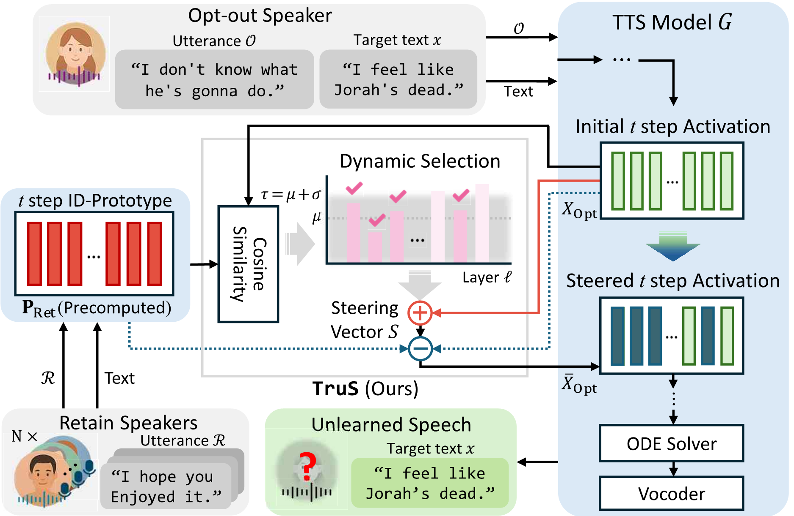

# [ICASSP'2026] Erasing Your Voice Before It’s Heard: Training-free Speaker Unlearning for Zero-shot Text-to-Speech

<p align="left">
  <a href="https://arxiv.org/abs/2601.20481">
    
  </a>
  <a href="http://mmai.ewha.ac.kr/trus">
    
  </a>  
</p>

Myungjin Lee, Eunji Shin, Jiyoung Lee<sup>+</sup>  
Department of Artificial Intelligence, Ewha Womans University

<br>

## 💡Architecture 


This repository contains the official implementation of **Trus**, a training-free inference-time steering method for **erasing speaker idenentity** zero-shot TTS models. 

We present TruS, a training-free speaker unlearning framework that shifts the paradigm from data deletion to inference-time control.
TruS steers identity-specific hidden activations to suppress target speakers while preserving other attributes (e.g., prosody and emotion).

<br>

## 🔍 Dataset

**plan to add info + explanation**
You can download datasets from...
- [Emilia](https://huggingface.co/datasets/amphion/Emilia-Dataset) : Seen opt-out dataset 
- [LibriSpeech test-clean](https://www.openslr.org/12) : Unseen opt-out
- [CREMA-D](https://github.com/CheyneyComputerScience/CREMA-D) : Test for Emotion presevation

<br>

## Getting started

### Environment setting
```bash
conda create -n trus python=3.11  
conda activate trus
pip install -r trus_requirements.txt
```

## 🗂️ Project Structure 
```
trus/
├── assets/                  # Images and figures for README/docs
├── ckpts/                   # Model checkpoints and pretrained weights
├── data/                    # Experimental data and evaluation results
│   ├── Emilia_out/               # Generated outputs and analysis results
│   │   ├── audio/                # Synthesized or processed audio files
│   │   ├── difference/           # Difference metrics before/after unlearning
│   │   ├── forget/               # Outputs from forgetting targets
│   │   └── remain/               # Outputs from remain samples
│   │       ├── remain_10/
│   │       ├── remain_30/
│   │       ├── remain_50/
│   │       └── remain_mean/
│   ├── Libri_out            # same structure as Emilia set
│   ├── CREMAD_test/         # same structure as Emilia set
│   
├── src/                     # Source code for inference, and evaluation
│   ├── eval/
│   ├── infer/
│
└── README.md
```

<br>

## 📑 Paper
* **Title:** *Erasing Your Voice Before It’s Heard: Training-free Speaker Unlearning for Zero-shot Text-to-Speech*  
* **Authors:** Myungjin Lee, Eunji Shin, Jiyoung Lee<sup>+</sup>
* **Affiliation:** Department of Artificial Intelligence, Ewha Womans University  
* **Paper:** [arXiv](https://arxiv.org/abs/2601.20481) 

<br>

## ☘️ Acknowledgements
**TruS** has been greatly inspired by the following amazing works and team :
- [F5-TTS](https://github.com/SWivid/F5-TTS)

We would like to thank the open-source projects for providing the foundations and inspiration for our implementation.  
Also, We hope that releasing this model/codebase helps the community to continue advancing open, responsible, and reproducible research.

<br>

## 📖 Citation

If you find this work useful for your research, please consider citing:

```bibtex
@inproceedings{lee2026erasing,
  title={Erasing Your Voice Before it’s Heard: Training-Free Speaker Unlearning for Zero-Shot Text-to-Speech},
  author={Lee, Myungjin and Shin, Eunji and Lee, Jiyoung},
  booktitle={ICASSP 2026-2026 IEEE International Conference on Acoustics, Speech and Signal Processing (ICASSP)},
  pages={17627--17631},
  year={2026},
  organization={IEEE}
}
