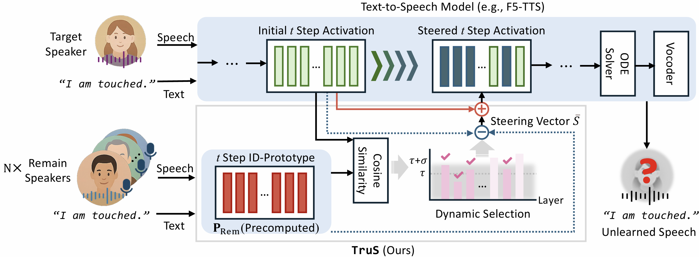

# 🙅🏻 Erasing Your Voice Before It’s Heard: Training-free Speaker Unlearning for Zero-shot Text-to-Speech

This repository contains the official implementation of **Trus**, a training-free inference-time steering method for erasing **speaker idenentity** zero-shot TTS models such as *F5-TTS*. 

## 📌 Abstract
Modern zero-shot text-to-speech (TTS) models offer unprecedented expressivity but also pose serious crime risks, as they can synthesize voices of individuals who never consented.
Existing unlearning approaches, reliant on retraining, are costly and limited to speakers seen in the training set.
We present \ours, a training-free speaker unlearning framework that shifts the paradigm from data deletion to inference-time control.
\ours steers identity-specific hidden activations to suppress target speakers while preserving other attributes (\eg, prosody and emotion).
Experiments on F5-TTS show that TruS effectively forgets both seen and unseen speakers without retraining, establishing a scalable safeguard for speech synthesis.
/*The demo is available on \url{http://mmai.ewha.ac.kr/trus}.*/

## 💡Architecture 

## 🔍 Dataset

**plan to add info + explanation**
- Emilia
- Libri 
- CREMA-D

## 🗂️ Project Structure 

## 📑 Paper
* **Title:** *Erasing Your Voice Before It’s Heard: Training-free Speaker Unlearning for Zero-shot Text-to-Speech*  
* **Authors:** Myungjin Lee, Eunji Shin, Jiyoung Lee+
* **Affiliation:** Department of Artificial Intelligence, Ewha Womans University  
* **Paper:** 
